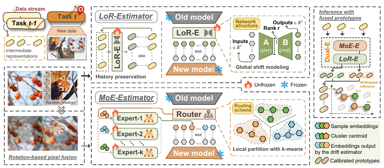

# Dual-Estimator: Decoupling Global and Local Semantic Shift for Drift Compensation in Class-Incremental LearningDual-E: Dual-Estimator for Exemplar-Free Class-Incremental Learning

[](http://cvpr.thecvf.com/)  [](https://pytorch.org/)

> ##### **Accepted by CVPR 2026**
>
> This repository provides the official implementation for Dual-E, a drift compensation method for Exemplar-Free Class-Incremental Learning (EFCIL).

## Overview

In EFCIL, it is common to retain intermediate representations (e.g., class prototypes) instead of raw samples. As the backbone evolves, these representations drift. Most drift compensation methods assume uniform semantic distributions and uniform semantic shifts, which is unrealistic under random class streams.

**Dual-E** addresses this by decoupling *local* and *global* semantic shifts with two complementary estimators:

- **MoE-Estimator (MoE-E)**: uses multiple experts to model local shift patterns, reducing bias from intra-task non-uniform semantic distributions.
- **Low-Rank Estimator (LoR-E)**: models global shift patterns with low-rank structure, stabilizing compensation for classes with large semantic gaps.



Dual-E relies on analytical updates, is computationally efficient, and can be plugged into existing EFCIL pipelines.
--------------------------------------------------------------------------------------------------------------------

## Repository Structure

- [main.py](main.py): entry point for running experiments
- [trainer.py](trainer.py): training and evaluation loop with logging and result saving
- [models/Dual_E.py](models/Dual_E.py): Dual-E implementation (MoE-E / LoR-E / RPF)
- [utils/data_manager.py](utils/data_manager.py): dataset management and incremental splits
- [exps/](exps/): experiment configs (CIFAR-100, TinyImageNet, ImageNet-Subset)
- [environment_Dual-E.yml](environment_Dual-E.yml): recommended conda environment

---

## Environment

Recommended setup (conda):

```
conda env create -f environment_Dual-E.yml
conda activate Dual-E
```

---

## Datasets

The paper evaluates on CIFAR-100, TinyImageNet, ImageNet-Subset, ImageNet-1K, CUB-200, and Stanford Cars.
Prepare or download datasets according to the definitions in [utils/data.py](utils/data.py).

---

## Quick Start

Run a single configuration:

```
python main.py --config=./exps/Dual_E_CIFAR100.json
```

Logs are written to logs/, and results are saved in results/ as Excel files (managed by [trainer.py](trainer.py)).

---

## Key Hyperparameters (Config)

- `expert_num`: number of experts in MoE-E
- `rank_prop`: LoR-E rank proportion
- `w_proto`: historical preservation weight in LoR-E
- `rout_T`: routing temperature
- `epoch_drift`: drift estimator training epochs (analytical update, usually small)
- `use_drift_compensation`: enable/disable Dual-E

---

## Paper and Citation

This work has been **accepted by CVPR 2026**. The official BibTeX entry will be released with the public version of the paper.

---

## Acknowledgement

This project is mainly based on [PyCIL](https://github.com/LAMDA-CL/PyCIL).This project is mainly based on [PyCIL](https://github.com/LAMDA-CL/PyCIL).
