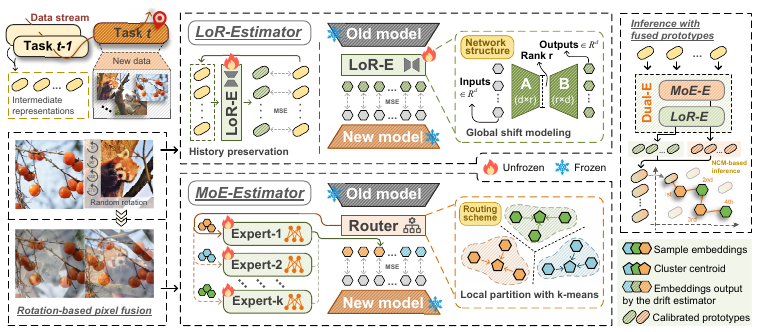

# Dual-Estimator: Decoupling Global and Local Semantic Shift for Drift Compensation in Class-Incremental Learning

> **Notice:** The codebase is currently being reorganized and will be released after the paper is online.

  

> ##### **Accepted by CVPR 2026**
>
> This repository provides the official implementation for Dual-E, a drift compensation method for Exemplar-Free Class-Incremental Learning (EFCIL).

## Overview

In EFCIL, it is common to retain intermediate representations (e.g., class prototypes) instead of raw samples. As the backbone evolves, these representations drift. Most drift compensation methods assume uniform semantic distributions and uniform semantic shifts, which is unrealistic under random class streams.

**Dual-E** addresses this by decoupling *local* and *global* semantic shifts with two complementary estimators:

- **MoE-Estimator (MoE-E)**: uses multiple experts to model local shift patterns, reducing bias from intra-task non-uniform semantic distributions.
- **Low-Rank Estimator (LoR-E)**: models global shift patterns with low-rank structure, stabilizing compensation for classes with large semantic gaps.

##### Dual-E relies on analytical updates, is computationally efficient, and can be plugged into existing EFCIL pipelines.

---

## Paper and Citation

This work has been **accepted by CVPR 2026**. The official BibTeX entry will be released with the public version of the paper.

---

## Acknowledgement

This project is mainly based on [PyCIL](https://github.com/LAMDA-CL/PyCIL).
